# CareerHub

A career-management dashboard built with React — track job applications through a kanban pipeline, build a resume with a live preview, get AI-assisted resume feedback and cover letters, and practice for interviews with an AI coach.

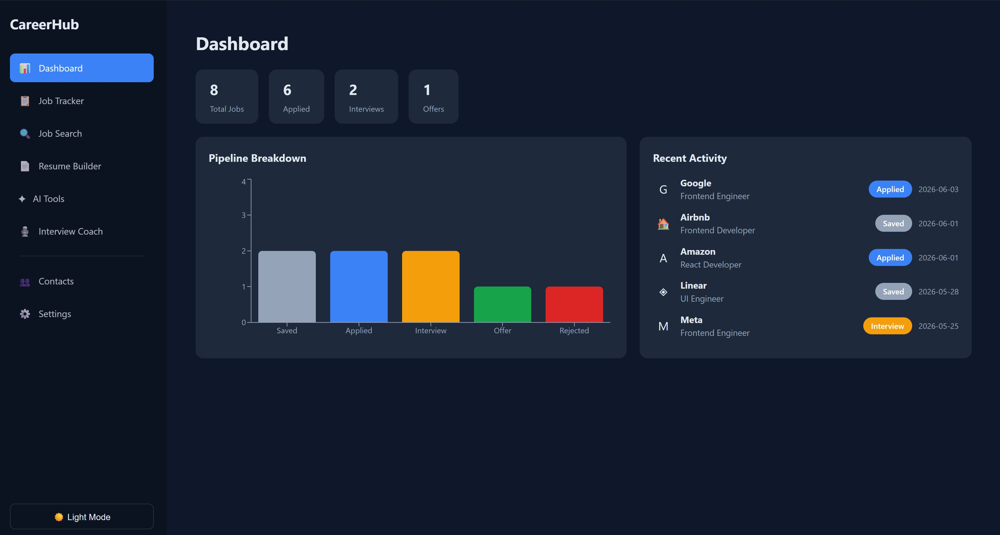

## Features

- **Login / Signup** — real authentication via Firebase: email/password and Google OAuth, with sessions that persist across refreshes
- **Protected routes** — logged-out users are redirected to the login page; logging in redirects straight into the app
- **Dashboard** — stat cards, pipeline breakdown chart (Recharts), recent activity feed
- **Job Tracker** — kanban board (Saved → Applied → Interview → Offer → Rejected), add/edit modal, delete confirmation, detail view, move jobs forward/backward, search + status filter chips, stats bar
- **Job Search** — browse sample listings, search by company/role/location, save straight into the tracker
- **Resume Builder** — tabbed editor (Contact, Summary, Skills, Experience) with a live preview pane
- **AI Tools** — resume analyzer (score out of 100 + strengths/weaknesses/suggestions) and a cover letter generator, both powered by Claude
- **Interview Coach** — multi-turn mock interview chat, also powered by Claude
- **Contacts** — simple contact list (name, company, role, notes)
- **Settings** — profile editing, theme toggle, reset resume / clear all jobs
- **Light/dark theme** — switchable via CSS custom properties, persisted across sessions

## Screenshots

| | |
|---|---|
| **Login** 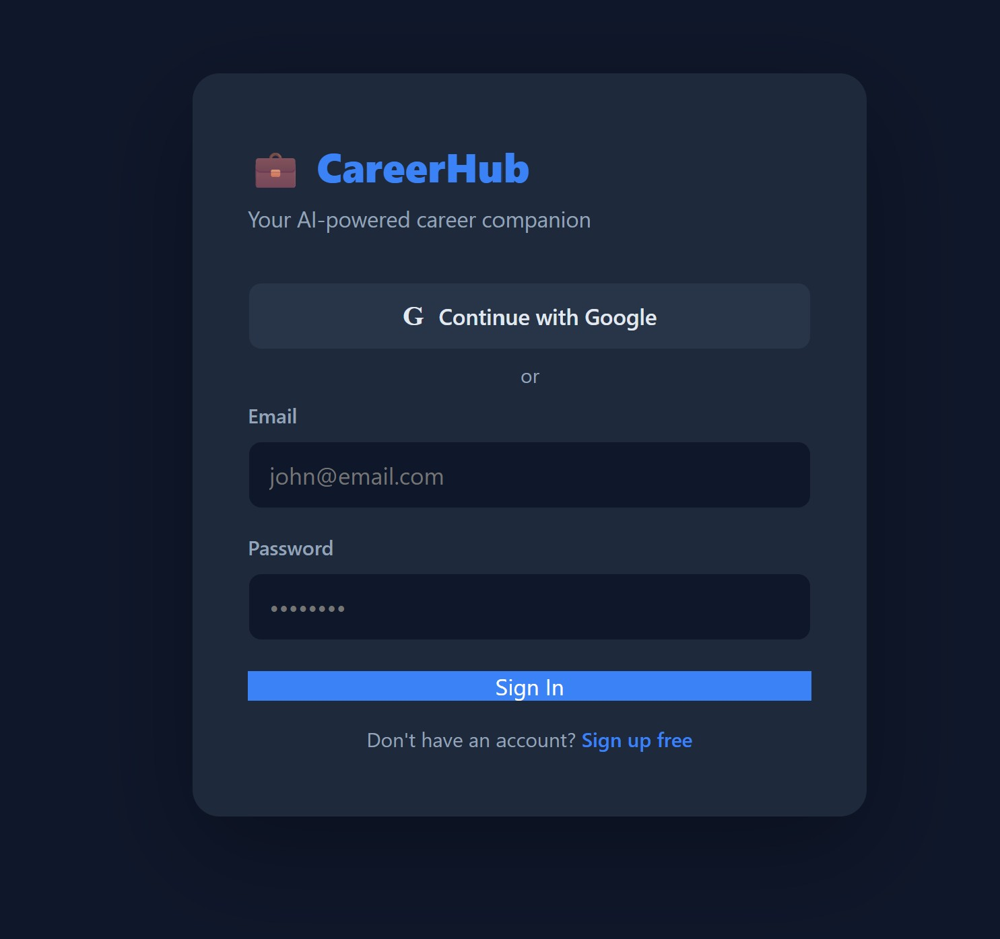 | **Job Tracker** 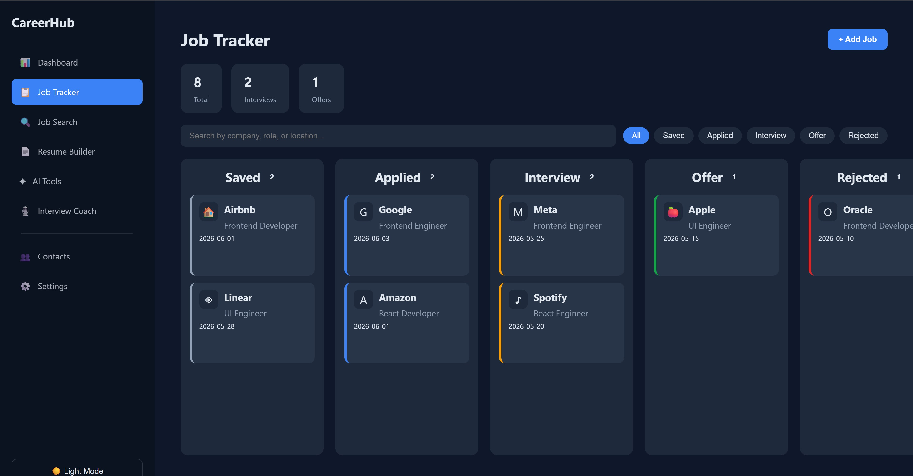 |
| **Add Job** 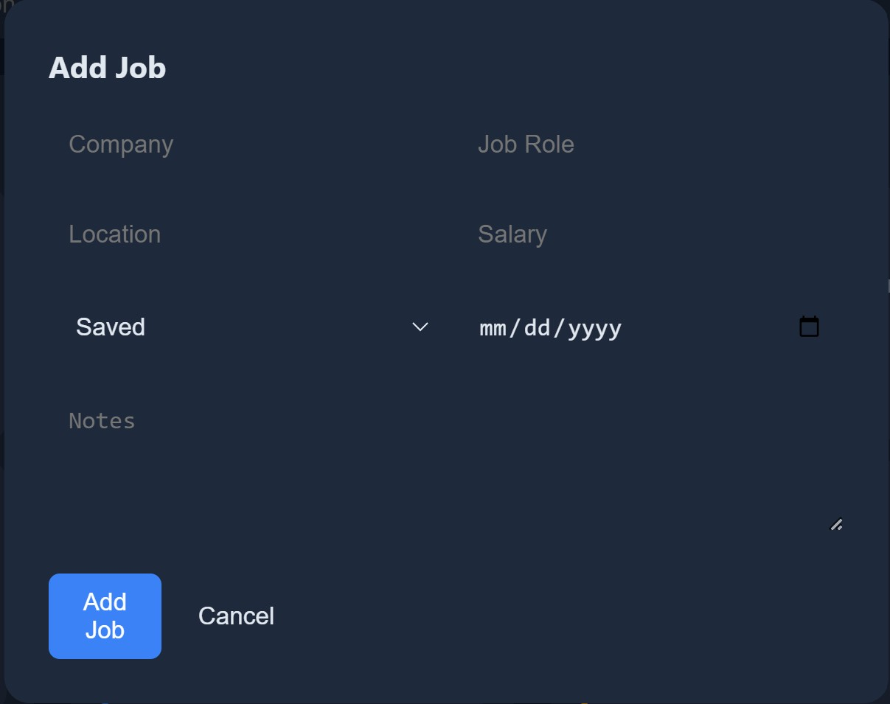 | **Job Search** 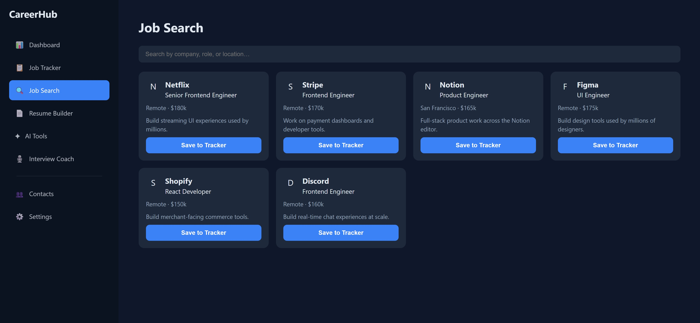 |
| **Resume Builder** 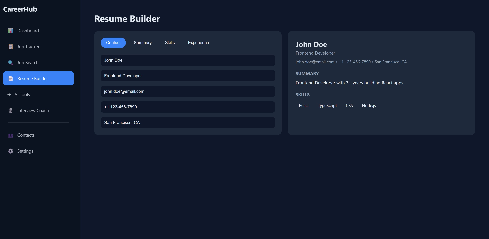 | **AI Tools** 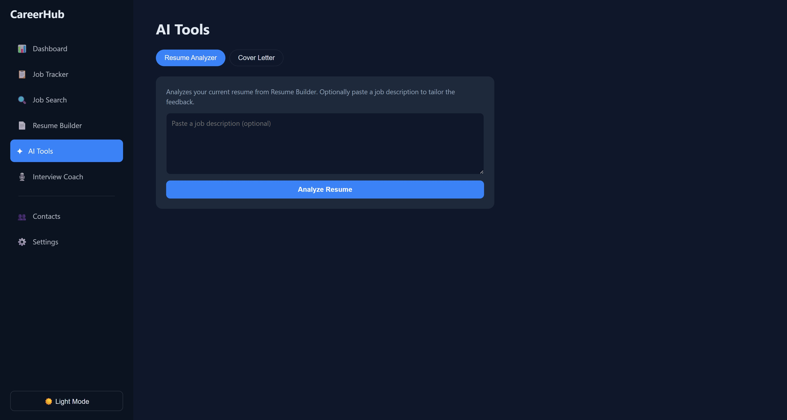 |
| **Interview Coach** 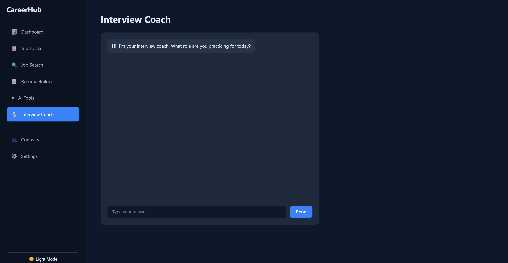 | **Contacts** 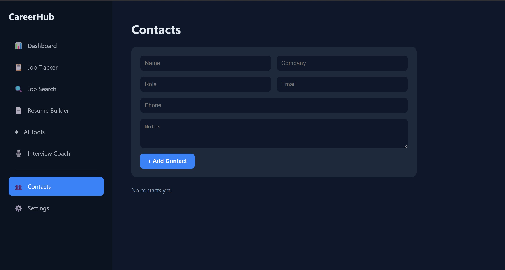 |
| **Settings** 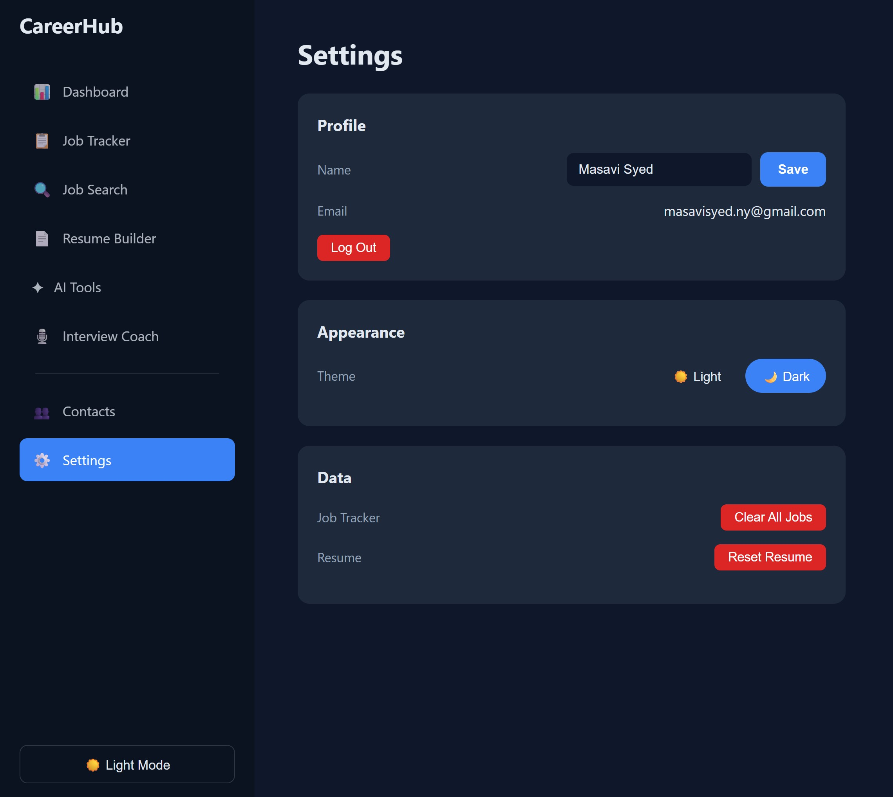 | **Light mode** 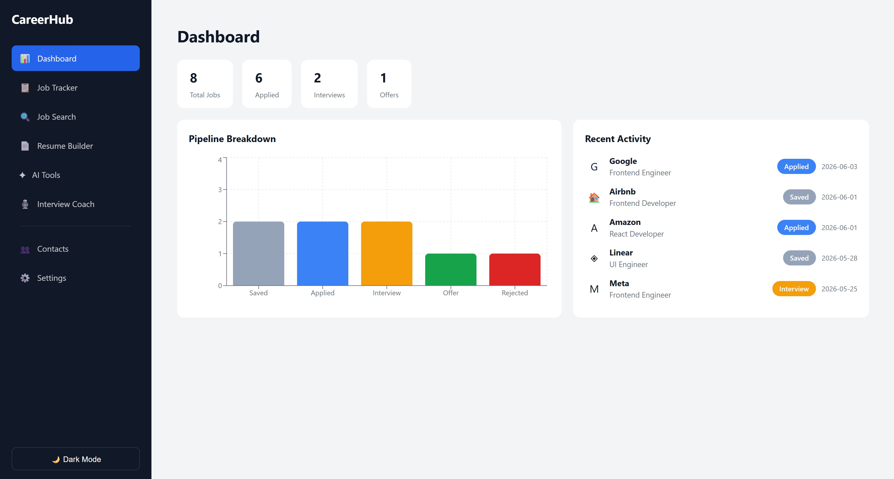 |

## Tech stack

- [React 19](https://react.dev) + [Vite](https://vitejs.dev)
- [React Router 7](https://reactrouter.com) for routing and protected routes
- [Firebase Authentication](https://firebase.google.com/docs/auth) for real signup/login (email + Google)
- [Recharts](https://recharts.org) for the dashboard chart
- [Anthropic API](https://docs.claude.com) (Claude) for resume analysis, cover letters, and the interview coach chat, proxied through a small local Express server (`server/`) so the API key never reaches the browser
- Context API + `useReducer` for global job state (`AppContext` / `JobReducer`)
- Custom hooks: `useLocalStorage` (persists theme/resume/contacts), `useDebounce` (search input), `useAI` (wraps Claude calls with loading/error state)

## Getting started

This app has two parts that both need to run: the Vite frontend, and a small Express server that proxies AI requests to Claude.

### 1. Frontend setup

```bash
npm install
```

Create a Firebase project (console.firebase.google.com), enable **Authentication → Email/Password** and **Google** sign-in, register a Web app, and put its config into `.env.local` in the project root:

```
VITE_FIREBASE_API_KEY=...
VITE_FIREBASE_AUTH_DOMAIN=...
VITE_FIREBASE_PROJECT_ID=...
VITE_FIREBASE_STORAGE_BUCKET=...
VITE_FIREBASE_MESSAGING_SENDER_ID=...
VITE_FIREBASE_APP_ID=...
```

### 2. AI server setup

```bash
cd server
npm install
```

Get an API key from console.anthropic.com and create `server/.env`:

```
ANTHROPIC_API_KEY=...
CLAUDE_MODEL=claude-sonnet-4-6
PORT=5174
```

### 3. Run both

```bash
# Terminal 1 — frontend
npm run dev

# Terminal 2 — AI proxy server
cd server && npm run dev
```

The app expects the AI server at `http://localhost:5174` (overridable via `VITE_AI_SERVER_URL`). Job Tracker, Resume Builder, Dashboard, and login all work without it — only AI Tools and Interview Coach need it running.

Other frontend scripts:

```bash
npm run build     # production build
npm run preview   # preview the production build locally
npm run lint       # run ESLint
```

## Project structure

```
src/
  components/      # Job Tracker UI (board, card, modals, filters, stats)
  context/         # AppContext — global jobs/resume/theme/user state
  firebase/        # Firebase init + auth service functions
  hooks/           # useLocalStorage, useDebounce, useAI
  layoutes/        # DashboardLayout (sidebar + page outlet)
  pages/           # One component per route
  routes/          # AppRoutes, ProtectedRoute
  services/        # claudeService — talks to the AI proxy server
  styles/          # Per-feature CSS, theme variables in global.css
  utils/           # Constants (nav, columns, seed data), JobReducer
server/             # Express server proxying Claude API calls (keeps the API key server-side)
```